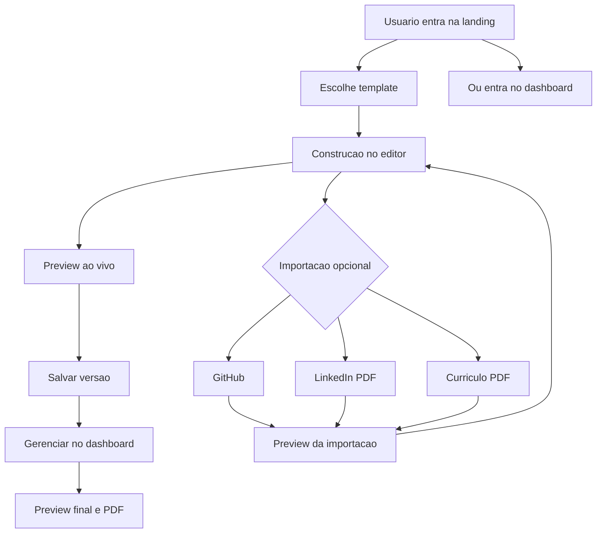
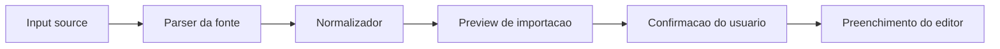
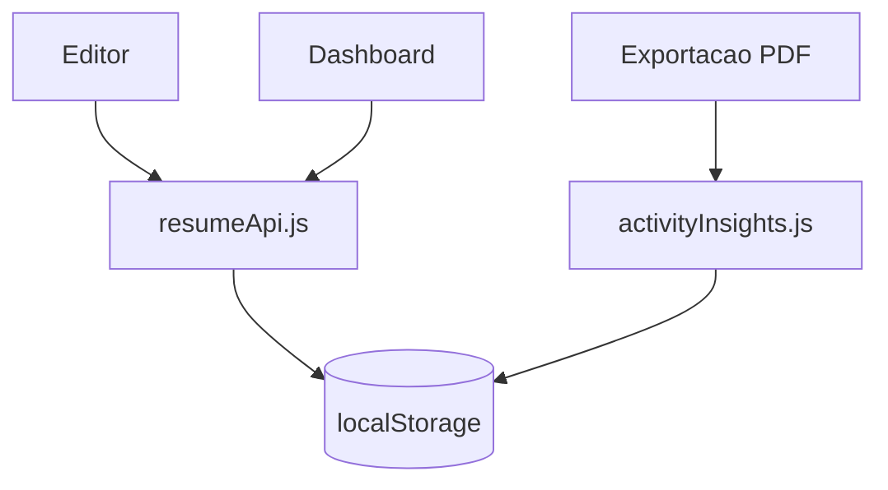

# Mapa Visual do Projeto

Visao consolidada da arquitetura atual do criador de curriculos, com foco em fluxo de produto, estrutura de codigo e integracoes.

## 1. Visao Macro

```mermaid
flowchart LR
  L[Landing<br/>/] --> T[Escolha de template<br/>/templates]
  L --> D[Dashboard<br/>/dashboard]
  D --> EE[Editor existente<br/>/editor/:id]
  T --> N[Editor novo<br/>/editor/new?template=...]
  N --> E[Editor]
  EE --> E[Editor]
  E --> D
  D --> P[Preview final<br/>/preview/:id]

  E --> I[Importacao inteligente]
  I --> GH[GitHub]
  I --> LI[LinkedIn PDF]
  I --> CV[Curriculo PDF]

  E <--> LS[(localStorage)]
  D <--> LS
  P --> PDF[/api/export-pdf]
  E --> AI[/api/ai/*]
  I --> IMP[/api/import-profile/*]
```

## 2. Fluxo Principal Do Produto



## 3. Estrutura Do Repositorio

```text
/home/ismael/cv
├── backend
│   ├── controllers
│   │   ├── aiController.js
│   │   ├── exportController.js
│   │   └── importController.js
│   ├── middleware
│   │   └── errorHandler.js
│   ├── routes
│   │   ├── aiRoutes.js
│   │   ├── exportRoutes.js
│   │   └── importRoutes.js
│   ├── services
│   │   ├── aiService.js
│   │   ├── pdfService.js
│   │   └── import
│   │       ├── githubParser.js
│   │       ├── normalizers.js
│   │       ├── pdfParser.js
│   │       └── profileImportService.js
│   ├── utils
│   │   └── http.js
│   └── server.js
├── frontend
│   ├── public
│   │   ├── robots.txt
│   │   └── templates
│   │       ├── manifest.json
│   │       ├── Gemini_Generated_Image_bkrspnbkrspnbkrs.png
│   │       ├── demo-photo.svg
│   │       └── *.png
│   ├── scripts
│   │   └── generate-template-images.mjs
│   ├── src
│   │   ├── components
│   │   │   ├── AiAssistantPanel.jsx
│   │   │   ├── AppFooter.jsx
│   │   │   ├── ArraySectionEditor.jsx
│   │   │   ├── Button.jsx
│   │   │   ├── CustomizationPanel.jsx
│   │   │   ├── Field.jsx
│   │   │   ├── Panel.jsx
│   │   │   ├── ProfileImportPanel.jsx
│   │   │   ├── ResumeCard.jsx
│   │   │   ├── ResumePreview.jsx
│   │   │   ├── SkillsEditor.jsx
│   │   │   └── TemplatePicker.jsx
│   │   ├── content
│   │   │   └── marketingContent.js
│   │   ├── hooks
│   │   │   └── useResumeEditor.js
│   │   ├── layouts
│   │   │   └── AppLayout.jsx
│   │   ├── pages
│   │   │   ├── DashboardPage.jsx
│   │   │   ├── EditorPage.jsx
│   │   │   ├── LandingPage.jsx
│   │   │   ├── PreviewPage.jsx
│   │   │   └── TemplateSelectionPage.jsx
│   │   ├── services
│   │   │   ├── activityInsights.js
│   │   │   ├── aiApi.js
│   │   │   ├── apiClient.js
│   │   │   ├── importProfileApi.js
│   │   │   ├── pdfApi.js
│   │   │   └── resumeApi.js
│   │   ├── styles
│   │   │   └── index.css
│   │   ├── templates
│   │   │   ├── AtelierTemplate.jsx
│   │   │   ├── ClassicTemplate.jsx
│   │   │   ├── CompactTemplate.jsx
│   │   │   ├── EditorialTemplate.jsx
│   │   │   ├── ExecutiveTemplate.jsx
│   │   │   ├── HorizonTemplate.jsx
│   │   │   ├── LedgerTemplate.jsx
│   │   │   ├── MinimalTemplate.jsx
│   │   │   ├── ModernTemplate.jsx
│   │   │   ├── MosaicTemplate.jsx
│   │   │   ├── NoirTemplate.jsx
│   │   │   ├── SpotlightTemplate.jsx
│   │   │   ├── TimelineTemplate.jsx
│   │   │   ├── templatePhoto.jsx
│   │   │   ├── templateRegistry.js
│   │   │   └── templateUtils.js
│   │   ├── utils
│   │   │   ├── cn.js
│   │   │   ├── profileImport.js
│   │   │   ├── resumeDefaults.js
│   │   │   └── validators.js
│   │   ├── App.jsx
│   │   └── main.jsx
│   └── package.json
└── PROJECT_MAP.md
```

## 4. Mapa Das Paginas

| Rota | Pagina | Papel no produto |
| --- | --- | --- |
| `/` | `LandingPage.jsx` | Aquisição, posicionamento, prova visual e CTA |
| `/dashboard` | `DashboardPage.jsx` | Centro operacional com metricas, rascunho e historico |
| `/templates` | `TemplateSelectionPage.jsx` | Galeria dedicada para escolha do template e estilo inicial antes da edicao |
| `/editor/new` | `EditorPage.jsx` | Criacao de novo curriculo a partir do template escolhido |
| `/editor/:id` | `EditorPage.jsx` | Edicao de curriculo existente |
| `/preview/:id` | `PreviewPage.jsx` | Visualizacao final e exportacao |

## 5. Mapa Do Frontend

### Nucleo

- `App.jsx`: roteamento lazy do produto.
- `main.jsx`: bootstrap do React.
- `AppLayout.jsx`: casca visual compartilhada.
- `index.css`: identidade visual global.

### Paginas

- `LandingPage.jsx`: marketing, hero, beneficios, templates reais e CTA final.
- `TemplateSelectionPage.jsx`: tela separada para escolher o template e a base de estilo antes do editor.
- `DashboardPage.jsx`: lista de curriculos, metricas locais, rascunho e historico de PDFs.
- `EditorPage.jsx`: formulario principal, importacao inteligente, customizacao e preview.
- `PreviewPage.jsx`: visualizacao dedicada antes da exportacao.

### Componentes

- `ProfileImportPanel.jsx`: fluxo "Como voce quer comecar?" com GitHub e PDFs.
- `TemplatePicker.jsx`: cards dos templates com thumbnails reais.
- `CustomizationPanel.jsx`: cor, fonte, espacamento e escala de titulos.
- `AiAssistantPanel.jsx`: demonstracao da camada inteligente prevista para a proxima fase do produto.
- `ResumePreview.jsx`: renderizacao ao vivo do template ativo.
- `ResumeCard.jsx`: card resumido de curriculo no dashboard.
- `ArraySectionEditor.jsx`, `SkillsEditor.jsx`, `Field.jsx`, `Panel.jsx`, `Button.jsx`: blocos reutilizaveis do editor.

### Servicos E Estado

- `useResumeEditor.js`: estado central do editor.
- `resumeApi.js`: persistencia local, limites do MVP e sanitizacao de dados.
- `activityInsights.js`: historico local de exportacoes.
- `importProfileApi.js`: chamadas para importacao inteligente.
- `pdfApi.js`: requisicoes de exportacao PDF.
- `aiApi.js`: integracao da camada de assistente em preparacao para evolucao proxima.
- `apiClient.js`: camada HTTP compartilhada.

## 6. Mapa Do Backend

```mermaid
flowchart TD
  S[server.js] --> R1[/api/ai]
  S --> R2[/api/import-profile]
  S --> R3[/api/export-pdf]
  R1 --> AC[aiController.js]
  R2 --> IC[importController.js]
  R3 --> EC[exportController.js]
  AC --> AS[aiService.js]
  IC --> IPS[profileImportService.js]
  IPS --> GP[githubParser.js]
  IPS --> PP[pdfParser.js]
  IPS --> N[normalizers.js]
  EC --> PS[pdfService.js]
  S --> EH[errorHandler.js]
```

### Responsabilidades

- `server.js`: sobe o Express, registra middlewares e rotas.
- `routes/*`: definem os endpoints publicos.
- `controllers/*`: traduzem request e response.
- `services/import/*`: parsing, limpeza e normalizacao de fontes externas.
- `pdfService.js`: gera PDF a partir do HTML renderizado.
- `errorHandler.js`: padroniza erros de API.

## 7. Pipeline De Importacao Inteligente



### Fontes Atuais

- `GitHub`: reforca resumo tecnico, skills, links e projetos.
- `LinkedIn PDF`: prioriza experiencia, formacao, certificacoes e competencias.
- `Curriculo em PDF`: prioriza reaproveitamento textual e migracao para templates melhores.

### Regras De Seguranca

- importacao revisavel antes de aplicar
- blocos suspeitos nao devem preencher o editor automaticamente
- parsing, limpeza e normalizacao separados para evolucao futura

## 8. Schema Interno Do Curriculo

```text
resume
├── title
├── personal
│   ├── fullName
│   ├── role
│   ├── objective
│   ├── photo
│   ├── email
│   ├── phone
│   ├── city
│   ├── linkedin
│   ├── github
│   └── portfolio
├── summary
├── experience[]
├── education[]
├── skills[]
├── languages[]
├── certifications[]
├── projects[]
├── additionalInfo
├── template
└── customization
    ├── primaryColor
    ├── fontFamily
    ├── spacing
    └── titleScale
```

## 9. Catalogo De Templates

Hoje o produto possui 13 templates:

1. Moderno
2. Classico
3. Executivo
4. Editorial
5. Minimalista
6. Compacto
7. Destaque
8. Timeline
9. Atelier
10. Horizonte
11. Noir
12. Mosaico
13. Ledger

Todos passam por `templateRegistry.js`, renderizam via `ResumePreview.jsx` e possuem thumbnails reais geradas em `frontend/public/templates/`.

## 10. Persistencia Local Do MVP



### Regras Atuais

- ate `5` curriculos locais salvos
- `1` rascunho ativo por editor
- historico local limitado dos ultimos PDFs exportados
- somente JSON leve e serializavel no `localStorage`

## 11. Build E Assets

- `frontend/scripts/generate-template-images.mjs`: gera previews reais dos templates.
- `frontend/public/templates/*.png`: miniaturas prontas para landing e seletor.
- `frontend/public/templates/manifest.json`: manifesto dos assets gerados.
- `frontend/package.json`: executa a geracao das imagens antes do build do frontend.

## 12. Leitura Rapida

Se quiser entender o projeto em poucos arquivos, a sequencia mais util e:

1. `frontend/src/App.jsx`
2. `frontend/src/pages/EditorPage.jsx`
3. `frontend/src/utils/resumeDefaults.js`
4. `frontend/src/services/resumeApi.js`
5. `frontend/src/templates/templateRegistry.js`
6. `backend/server.js`
7. `backend/services/import/profileImportService.js`
8. `backend/services/import/pdfParser.js`
